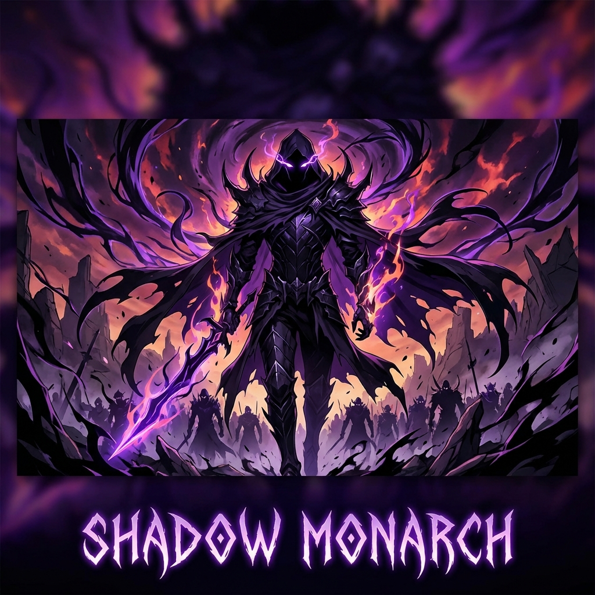

# 🌑 **ASHBORN: The Shadow Monarch** 🌑

> *“I alone level up.”* — Sung Jin-Woo

**Ashborn** is a **production-grade privacy protocol** for Solana that enables:
*   **⚔️ Private Transfers** — Send SOL/tokens without revealing sender, recipient, or amount
*   **🔮 Selective Disclosure** — Prove balance ranges without revealing exact amounts
*   **👻 Stealth Addresses** — Receive payments at unlinkable addresses
*   **🛡️ NFT Privacy** — Own and prove NFT traits without revealing which NFT

Built with **real ZK proofs (Groth16)**, **Merkle tree nullifiers**, and a **compliance-friendly** design.

---

## 🐳 **Easily Run with Docker**

Arise without installing dependencies manually. Run the full Ashborn demo environment in seconds.

### **Prerequisites**
*   [Docker Desktop](https://www.docker.com/products/docker-desktop/) (must be running as a daemon)

### **Command**

```bash
docker-compose up --build -d
```
Once running, open the **Shadow Portal** at:
👉 **[http://localhost:3000](http://localhost:3000)**

---

## 💀 **Why You Need This**

### **The Problem**
Every Solana transaction is public. Your wallet balance, transaction history, and business dealings are visible to:
*   Competitors analyzing your treasury 👁️
*   Attackers tracking whale wallets 🦈
*   Anyone curious about your finances 🕵️

### **The Solution**
Ashborn creates a **Shadow Domain** where:
*   Amounts are hidden in cryptographic commitments
*   Sender/recipient are unlinkable via stealth addresses
*   Double-spends are prevented with nullifiers
*   Compliance is preserved via selective disclosure proofs

---

## 🏰 **Architecture**

```
┌─────────────────────────────────────────────────────────────┐
│                     ASHBORN PROTOCOL                        │
├─────────────────┬─────────────────┬─────────────────────────┤
│   Privacy Cash  │   ShadowWire    │   Range Compliance      │
│   (Shielded)    │   (Stealth)     │   (Disclosure)          │
├─────────────────┴─────────────────┴─────────────────────────┤
│                    ASHBORN SDK (TypeScript)                 │
│  ┌─────────┐ ┌─────────┐ ┌─────────┐ ┌─────────┐ ┌────────┐ │
│  │ Crypto  │ │ Relayer │ │ Indexer │ │  Helius │ │  NFT   │ │
│  │Poseidon │ │ Privacy │ │ Merkle  │ │ DAS+WH  │ │Privacy │ │
│  │ AES-GCM │ │  Tx Sub │ │  Tree   │ │ API     │ │Traits  │ │
│  └─────────┘ └─────────┘ └─────────┘ └─────────┘ └────────┘ │
├─────────────────────────────────────────────────────────────┤
│                  SOLANA PROGRAM (Rust/Anchor)               │
│  ┌─────────────┐ ┌─────────────┐ ┌─────────────────────────┐ │
│  │ ZK Verifier │ │ Merkle Tree │ │ Instructions            │ │
│  │ Groth16     │ │ Nullifiers  │ │ shield/transfer/unshield│ │
│  │ Poseidon    │ │ Commitments │ │ reveal/prove            │ │
│  └─────────────┘ └─────────────┘ └─────────────────────────┘ │
├─────────────────────────────────────────────────────────────┤
│                     SOLANA BLOCKCHAIN                       │
└─────────────────────────────────────────────────────────────┘
```

---

## ⚔️ **Manual Quick Start**

If you prefer to run manually without Docker shadows:

### **Prerequisites**
*   Node.js 18+
*   Rust 1.70+
*   Solana CLI
*   Anchor 0.30+

### **Installation**

```bash
# Clone the repository
git clone https://github.com/your-org/ashborn.git
cd ashborn

# Install Dependencies
npm install

# Run the UI
cd app
npm install
npm run dev
```

---

## 🔮 **Using the SDK**

```bash
npm install @ashborn/sdk
```

```typescript
import { Ashborn, NaturalLanguageAshborn } from '@ashborn/sdk';
import { Connection, Keypair } from '@solana/web3.js';

// Initialize
const connection = new Connection('https://api.devnet.solana.com');
const wallet = loadWallet(); // Your wallet adapter
const ashborn = new Ashborn(connection, wallet);

// Shield 1 SOL (hide it)
await ashborn.shield({
  amount: 1_000_000_000n, // 1 SOL in lamports
  mint: 'So11111111111111111111111111111111111111112',
});

// Send privately
await ashborn.shadowTransfer({
  amount: 500_000_000n,
  recipientStealth: recipientStealthAddress,
});

// Prove balance without revealing it
await ashborn.proveRange({
  min: 0n,
  max: 10_000_000_000_000n, // Under $10,000
});

// Unshield (exit private mode)
await ashborn.unshield({
  amount: 200_000_000n,
});
```

---

## 🩸 **How Privacy Works**

### **1. Shield (Deposit)**
```
User deposits 1 SOL → Creates commitment C = Poseidon(amount, blinding)
                   → On-chain: only C is visible
                   → Amount is encrypted with user's view key
```

### **2. Transfer (Private Send)**
```
Sender reveals nullifier N (prevents double-spend)
       → Creates output commitment for recipient
       → Creates change commitment for self
       → Generates ZK proof
       → Adds 3 decoy outputs (ZachXBT-proof)
       → Submits via relayer (sender unlinkability)
```

### **3. Selective Disclosure**
```
User needs to prove balance > $10,000 for loan
     → Generates Bulletproof range proof
     → Proof shows: balance ∈ [$10,000, ∞)
     → Does NOT reveal exact balance
```

---

## 🧪 **Running Tests**

```bash
# SDK unit tests
cd sdk && npm run test

# Integration tests (requires local validator)
anchor test

# E2E tests
cd sdk && npm run test:e2e
```

---

## 🔧 **Configuration**

### **Environment Variables**

```bash
# Required
SOLANA_RPC_URL=https://api.devnet.solana.com

# Optional (for enhanced features)
HELIUS_API_KEY=your-helius-key        # For DAS API and webhooks
OPENAI_API_KEY=your-openai-key        # For natural language parsing
RELAYER_ENDPOINT=https://relay.ashborn.network
```

---

## 🤝 **Contributing**

1.  Fork the repository
2.  Create feature branch (`git checkout -b feature/amazing`)
3.  Commit changes (`git commit -m 'Add amazing feature'`)
4.  Push to branch (`git push origin feature/amazing`)
5.  Open Pull Request

---

## 📜 **License**

MIT License — See [LICENSE](LICENSE) for details.

---

## 🙏 **Acknowledgments**

*   **Light Protocol** — PSP and Merkle tree inspiration
*   **Helius** — DAS API and smart transactions
*   **Range Protocol** — Bulletproof compliance
*   **Zcash** — Original shielded pool design
*   **Solo Leveling** — Shadow Monarch theming 🌑

---

<p align="center">
  <b>ARISE.</b>
</p>
